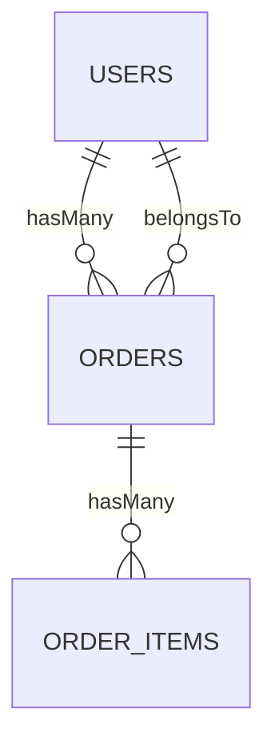
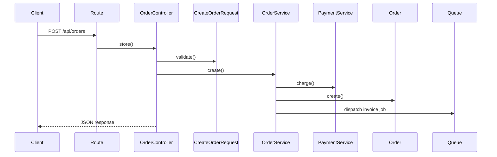
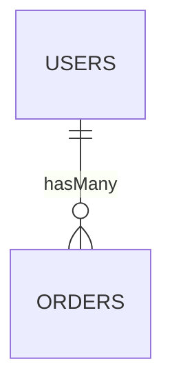

# PRD - Laravel Archmap

**Dokumen:** Product Requirements Document  
**Produk:** Laravel Archmap  
**Tipe Produk:** Composer package / Laravel dev package  
**Target Pengguna:** Laravel developer, software house, agency, tim internal IT, technical lead  
**Versi PRD:** 1.0  
**Tanggal:** 25 April 2026  
**Owner Produk:** Ardana  
**Status:** Siap digunakan untuk perencanaan development MVP dan v1.0 production

---

## 1. Ringkasan Produk

Laravel Archmap adalah package Composer untuk Laravel yang membantu developer membuat dokumentasi arsitektur aplikasi secara otomatis dari codebase. Package ini membaca route, controller, model Eloquent, relationship, class, service, job, event, listener, migration, dan dependency tertentu, lalu menghasilkan diagram dan dokumen teknis dalam format Mermaid, PlantUML, Markdown, JSON, dan file pendukung lain.

Produk ini tidak hanya menjadi generator UML biasa. Fokus utamanya adalah membantu tim memahami struktur aplikasi Laravel dengan cepat, menjaga dokumentasi tetap mengikuti perubahan codebase, dan mengurangi masalah onboarding, handover project, audit teknis, serta miskomunikasi antar developer.

Contoh penggunaan:

```bash
composer require ms/laravel-archmap --dev
php artisan vendor:publish --tag=archmap-config
php artisan archmap:generate
```

Output utama:

```text
docs/architecture.md
docs/diagrams/erd.mmd
docs/diagrams/routes.mmd
docs/diagrams/classes.mmd
docs/diagrams/components.mmd
docs/archmap-report.json
```

Value proposition:

> Laravel Archmap membantu developer memahami arsitektur Laravel dalam hitungan menit, bukan berhari-hari membaca codebase lama yang dokumentasinya sudah menyerah pada kehidupan.

---

## 2. Latar Belakang Masalah

Banyak project Laravel berkembang cepat tanpa dokumentasi arsitektur yang terjaga. Saat project sudah masuk production, tim biasanya menghadapi masalah berikut:

1. Developer baru sulit memahami struktur aplikasi.
2. Handover project dari freelancer atau vendor tidak rapi.
3. Relationship antar model tidak terdokumentasi.
4. Route API banyak, tetapi tidak ada route map yang mudah dibaca.
5. Controller dan service saling bergantung tanpa diagram dependency.
6. Dokumentasi manual cepat basi setelah beberapa sprint.
7. Technical lead sulit melihat perubahan arsitektur dari waktu ke waktu.
8. Agency sulit menjelaskan struktur project kepada klien teknis.
9. Tim tidak punya artifact teknis untuk audit, maintenance, atau refactor.

Masalah-masalah ini membuat onboarding lambat, bug makin sulit ditelusuri, dan project legacy terasa seperti labirin yang dibangun oleh seseorang yang membenci masa depan.

---

## 3. Tujuan Produk

### 3.1 Tujuan Bisnis

1. Menjadi package Laravel populer untuk dokumentasi arsitektur otomatis.
2. Membantu software house dan freelancer meningkatkan kualitas handover project.
3. Membuka peluang monetisasi open-core melalui fitur Pro, seperti architecture health report, CI diff, advanced sequence diagram, dan SaaS dashboard.
4. Mengurangi waktu onboarding developer baru pada project Laravel.
5. Menjadi tool standar untuk menghasilkan technical documentation di repo Laravel.

### 3.2 Tujuan Pengguna

1. Developer bisa menghasilkan diagram ERD, route map, class diagram, dan architecture docs dari command Artisan.
2. Technical lead bisa melihat struktur dan risiko arsitektur tanpa inspeksi manual panjang.
3. Agency bisa memberikan dokumentasi teknis yang rapi kepada klien.
4. Tim bisa menyimpan diagram sebagai file di repository dan melacak perubahannya lewat Git.
5. Dokumentasi bisa dihasilkan ulang kapan saja tanpa harus menggambar manual.

### 3.3 Tujuan Teknis

1. Package mudah di-install sebagai dev dependency.
2. Tidak mengirim source code ke server eksternal secara default.
3. Tidak mengubah source code aplikasi pengguna.
4. Mendukung output diagram-as-code.
5. Bisa dijalankan di lokal dan CI/CD.
6. Bisa dikonfigurasi agar aman untuk codebase besar.
7. Memiliki test suite yang kuat menggunakan fixture Laravel project.

---

## 4. Non-Goals

Hal berikut tidak termasuk scope awal:

1. Menghasilkan dokumentasi yang 100% sempurna untuk semua pola dynamic programming Laravel.
2. Menggantikan Swagger/OpenAPI untuk dokumentasi kontrak API.
3. Mengubah codebase user secara otomatis.
4. Mengirim source code user ke AI cloud secara default.
5. Membuat visual editor drag-and-drop pada MVP.
6. Mendukung framework selain Laravel pada versi awal.
7. Menjadi runtime profiler atau APM.
8. Membaca semua dependency dari folder `vendor`.
9. Menghasilkan sequence diagram sempurna tanpa batasan, karena static analysis pada aplikasi dinamis punya batas yang nyata.
10. Menjadi alat audit security penuh seperti SAST enterprise.

---

## 5. Target Pengguna dan Persona

### 5.1 Persona 1 - Freelance Laravel Developer

**Nama:** Raka  
**Kebutuhan:** Butuh dokumentasi cepat untuk handover project ke klien.  
**Pain Point:** Menulis dokumentasi manual memakan waktu dan sering tidak dibayar.  
**Nilai Produk:** Bisa generate architecture docs dan ERD sebelum project diserahkan.

### 5.2 Persona 2 - Software House Owner

**Nama:** Maya  
**Kebutuhan:** Standarisasi dokumentasi untuk banyak project klien.  
**Pain Point:** Setiap developer punya gaya dokumentasi berbeda.  
**Nilai Produk:** Bisa menjadikan Laravel Archmap sebagai bagian dari workflow delivery.

### 5.3 Persona 3 - Technical Lead

**Nama:** Fajar  
**Kebutuhan:** Memahami dependency, route, service, dan model relationship secara cepat.  
**Pain Point:** Codebase besar sulit dipetakan manual.  
**Nilai Produk:** Bisa melihat diagram arsitektur dan health report dari CLI.

### 5.4 Persona 4 - Developer Baru di Project Legacy

**Nama:** Sinta  
**Kebutuhan:** Perlu memahami project Laravel lama tanpa bimbingan penuh.  
**Pain Point:** Dokumentasi tidak ada, route banyak, dan struktur folder tidak konsisten.  
**Nilai Produk:** Bisa menjalankan `php artisan archmap:generate` untuk mendapat peta awal project.

---

## 6. Positioning Produk

### 6.1 Kalimat Positioning

Laravel Archmap adalah package Laravel untuk menghasilkan dokumentasi arsitektur otomatis dari codebase, termasuk ERD, route map, class diagram, component diagram, sequence diagram, dan architecture report.

### 6.2 Pembeda Utama

1. Fokus pada Laravel, bukan PHP generik.
2. Output utama berupa diagram-as-code yang bisa disimpan di Git.
3. Mermaid sebagai default agar mudah dipakai di Markdown dan GitHub.
4. PlantUML sebagai format lanjutan untuk UML formal.
5. CLI-first dan CI-friendly.
6. Tidak perlu upload codebase.
7. Mendukung architecture report, bukan cuma diagram.
8. Bisa dikembangkan menjadi open-core package.

### 6.3 Tagline

> Generate Laravel architecture documentation from your codebase.

Versi Indonesia:

> Buat dokumentasi arsitektur Laravel otomatis dari codebase.

---

## 7. Scope Produk

### 7.1 Scope MVP

MVP harus mencakup:

1. Instalasi via Composer sebagai dev dependency.
2. Auto-discovery Laravel service provider.
3. Config publish via `vendor:publish`.
4. Command `archmap:generate`.
5. Command `archmap:routes`.
6. Command `archmap:erd`.
7. Command `archmap:classes`.
8. Renderer Mermaid.
9. Renderer Markdown.
10. Output JSON internal untuk debugging dan CI.
11. Basic architecture report.
12. Dokumentasi README lengkap.
13. Test suite minimal untuk scanner dan renderer.

### 7.2 Scope v1.0 Production

v1.0 production harus mencakup:

1. Semua fitur MVP.
2. PlantUML renderer.
3. Sequence diagram sederhana berbasis route dan controller method.
4. Component diagram untuk controller, service, job, event, listener, model.
5. Architecture health report lanjutan (rule lebih kaya dari MVP).
6. CI mode dengan exit code.
7. Ignore path dan ignore class.
8. Snapshot testing untuk output diagram.
9. Dokumentasi instalasi, konfigurasi, command, troubleshooting, dan limitation.
10. Compatibility matrix untuk PHP dan Laravel.
11. Changelog dan semantic versioning.

### 7.3 Scope v1.5 atau Pro

1. Architecture diff antar commit.
2. PR comment generator.
3. SVG/PNG export tanpa dependency yang merepotkan user.
4. Interactive web viewer lokal.
5. Advanced sequence diagram dengan AST call graph.
6. AI explanation mode opsional.
7. SaaS dashboard untuk multi-project.
8. Team template dan branded report.
9. Cache dan incremental scan.

---

## 8. User Journey

### 8.1 Journey: Developer Menggunakan Package Pertama Kali

1. Developer install package:

```bash
composer require ms/laravel-archmap --dev
```

2. Developer publish config:

```bash
php artisan vendor:publish --tag=archmap-config
```

3. Developer menjalankan generate:

```bash
php artisan archmap:generate
```

4. Package melakukan scanning.
5. Package membuat folder output.
6. Package menghasilkan file diagram dan dokumentasi.
7. Developer membuka `docs/architecture.md`.
8. Developer commit file dokumentasi ke repository.

### 8.2 Journey: Technical Lead Memeriksa Architecture Health

1. Technical lead menjalankan:

```bash
php artisan archmap:report
```

2. Package membaca route, model, class, service, dependency, dan relationship.
3. Package menghasilkan ringkasan risiko.
4. Technical lead melihat warning seperti controller terlalu besar, service terlalu banyak dependency, route tanpa middleware, atau model relationship kompleks.
5. Technical lead membuat keputusan refactor.

### 8.3 Journey: CI/CD Menjalankan Archmap

1. Pipeline menjalankan:

```bash
php artisan archmap:ci --fail-on=critical
```

2. Package menghasilkan diagram dan report.
3. Jika ditemukan issue critical, command exit dengan code non-zero.
4. Pipeline gagal agar tim mengecek perubahan arsitektur.
5. Jika tidak ada issue critical, pipeline lanjut.

---

## 9. Requirement Fungsional

### FR-001 - Instalasi Package

**Prioritas:** P0  
**Status:** MVP  
**Deskripsi:** User dapat menginstall package sebagai Composer dev dependency.

**Command:**

```bash
composer require ms/laravel-archmap --dev
```

**Acceptance Criteria:**

1. Package bisa di-install di Laravel versi target.
2. Service provider otomatis terdaftar melalui Laravel package discovery.
3. Package tidak menjalankan scanner otomatis saat install.
4. Package tidak membuat atau mengubah file project kecuali user menjalankan command eksplisit.
5. Package tidak membutuhkan dependency eksternal berat untuk menjalankan fitur dasar.

---

### FR-002 - Publish dan Merge Config

**Prioritas:** P0  
**Status:** MVP  
**Deskripsi:** User dapat publish file konfigurasi dan package tetap memiliki default config jika user tidak publish config.

**Command:**

```bash
php artisan vendor:publish --tag=archmap-config
```

**Output:**

```text
config/archmap.php
```

**Acceptance Criteria:**

1. Config default tersedia dari package.
2. Config dapat dipublish ke folder `config` aplikasi.
3. Config dapat diakses melalui `config('archmap.*')`.
4. Config tidak menggunakan closure agar aman untuk `config:cache`.
5. Jika config tidak dipublish, package tetap berjalan.

---

### FR-003 - Generate Semua Dokumentasi

**Prioritas:** P0  
**Status:** MVP  
**Deskripsi:** User dapat menghasilkan semua output utama melalui satu command.

**Command:**

```bash
php artisan archmap:generate
```

**Default Output:**

```text
docs/architecture.md
docs/diagrams/erd.mmd
docs/diagrams/routes.mmd
docs/diagrams/classes.mmd
docs/archmap-report.json
```

**Acceptance Criteria:**

1. Command menghasilkan semua output yang dikonfigurasi.
2. Command membuat folder output jika belum ada.
3. Command menampilkan summary hasil generate di console.
4. Command gagal dengan pesan jelas jika folder tidak bisa ditulis.
5. Command tetap berjalan jika salah satu scanner tidak menemukan data, selama tidak ada error fatal.
6. Command memiliki exit code `0` saat berhasil.
7. Command memiliki exit code non-zero saat terjadi error konfigurasi atau permission.

---

### FR-004 - Route Map Scanner

**Prioritas:** P0  
**Status:** MVP  
**Deskripsi:** Package membaca Laravel route collection dan menghasilkan route map.

**Command:**

```bash
php artisan archmap:routes
```

**Data yang Dibaca:**

1. HTTP method.
2. URI.
3. Route name.
4. Controller class.
5. Controller method.
6. Middleware.
7. Domain jika ada.
8. Prefix jika ada.

**Output Markdown:**

```markdown
| Method | URI | Name | Controller | Middleware |
|---|---|---|---|---|
| GET | /api/users | users.index | UserController@index | api,auth:sanctum |
```

**Output Mermaid:**

```mermaid
flowchart TD
    R1[GET /api/users] --> C1[UserController@index]
    R2[POST /api/orders] --> C2[OrderController@store]
```

**Acceptance Criteria:**

1. Scanner membaca route web dan API.
2. Scanner dapat mengecualikan route vendor atau route tertentu lewat config.
3. Scanner dapat memfilter berdasarkan method, prefix, atau middleware.
4. Output route map stabil, terurut, dan mudah di-diff di Git.
5. Closure route ditandai sebagai `Closure`.
6. Route tanpa nama tetap ditampilkan.
7. Route dengan multiple method ditampilkan dengan format konsisten.

---

### FR-005 - Eloquent ERD Scanner

**Prioritas:** P0  
**Status:** MVP  
**Deskripsi:** Package membaca model Eloquent dan relationship untuk menghasilkan ERD.

**Command:**

```bash
php artisan archmap:erd
```

**Relationship yang Didukung pada MVP:**

1. `belongsTo`
2. `hasOne`
3. `hasMany`
4. `belongsToMany`
5. `morphOne`
6. `morphMany`
7. `morphTo`
8. `morphToMany`

**Sumber Data:**

1. Reflection method pada model.
2. AST parsing method body jika dibutuhkan.
3. Migration scanner opsional untuk field tabel.
4. Config manual override untuk relationship yang tidak terdeteksi.

**Output Mermaid ERD:**



**Acceptance Criteria:**

1. Scanner menemukan model di folder yang dikonfigurasi.
2. Scanner tidak memanggil method relationship jika berisiko menjalankan query tidak perlu.
3. Scanner dapat membaca return type atau AST untuk mendeteksi relationship.
4. Scanner menampilkan warning untuk relationship yang ambigu.
5. Output ERD tetap valid walau sebagian relationship gagal terbaca.
6. User dapat menambahkan manual mapping lewat config.
7. Model abstract dan trait tidak dianggap entity kecuali dikonfigurasi.

---

### FR-006 - Class Diagram Scanner

**Prioritas:** P0  
**Status:** MVP  
**Deskripsi:** Package membaca class PHP pada namespace tertentu dan menghasilkan class diagram.

**Command:**

```bash
php artisan archmap:classes --namespace="App\\Services"
```

**Data yang Dibaca:**

1. Class name.
2. Namespace.
3. Extends.
4. Implements.
5. Traits.
6. Public methods.
7. Protected methods jika diaktifkan.
8. Constructor dependencies.
9. Public properties.

**Acceptance Criteria:**

1. Scanner dapat memindai namespace dan path yang dikonfigurasi.
2. Scanner mengabaikan `vendor`, `storage`, dan path ignore.
3. Scanner dapat membatasi jumlah method yang ditampilkan per class.
4. Output tidak terlalu besar pada codebase besar.
5. User dapat menggunakan option `--namespace` dan `--path`.
6. Trait dan interface ditampilkan dengan penanda berbeda.
7. Dependency constructor ditampilkan sebagai edge opsional.

---

### FR-007 - Component Diagram

**Prioritas:** P1  
**Status:** v1.0  
**Deskripsi:** Package membuat diagram komponen Laravel dari controller, service, repository, job, event, listener, policy, request, resource, dan model.

**Command:**

```bash
php artisan archmap:components
```

**Acceptance Criteria:**

1. Package mengelompokkan class berdasarkan folder atau namespace.
2. Package dapat menampilkan edge controller ke service, service ke model, event ke listener, dan controller ke request.
3. Package memberikan fallback grouping jika struktur folder tidak standar.
4. User dapat mengubah pattern klasifikasi melalui config.
5. Output bisa berupa Mermaid flowchart dan PlantUML component diagram.

---

### FR-008 - Sequence Diagram Per Route

**Prioritas:** P1  
**Status:** v1.0  
**Deskripsi:** Package menghasilkan sequence diagram sederhana dari route tertentu.

**Command:**

```bash
php artisan archmap:sequence --route="POST /api/orders"
```

**Output Contoh:**



**Acceptance Criteria:**

1. User dapat memilih route berdasarkan method dan URI.
2. Package mendeteksi controller method dari route.
3. Package mendeteksi FormRequest jika digunakan pada method signature.
4. Package mendeteksi dependency dari constructor controller.
5. Package mendeteksi service method call dasar menggunakan AST.
6. Package mendeteksi model static call umum seperti `Model::query()`, `Model::create()`, `Model::find()`.
7. Package mendeteksi dispatch job dan event call umum.
8. Output menyertakan `confidence score`.
9. Jika sequence tidak bisa dibuat, package memberi pesan alasan dan saran.

---

### FR-009 - Architecture Health Report

**Prioritas:** P0  
**Status:** MVP  
**Deskripsi:** Package menghasilkan laporan risiko arsitektur berbasis rule sederhana (baseline).

**Command:**

```bash
php artisan archmap:report
```

**Contoh Warning:**

```text
WARNING: OrderController has 18 public methods.
WARNING: PaymentService has 9 constructor dependencies.
WARNING: User model has 22 relationships.
INFO: 187 routes detected.
INFO: 42 models detected.
```

**Rule Default:**

1. Controller memiliki terlalu banyak public method.
2. Service memiliki terlalu banyak constructor dependency.
3. Model memiliki terlalu banyak relationship.
4. Route tidak memiliki middleware pada prefix tertentu.
5. Class terlalu panjang berdasarkan jumlah method.
6. Dependency circular sederhana terdeteksi.
7. Output diagram terlalu besar.

**Acceptance Criteria:**

1. Report menghasilkan severity `info`, `warning`, `critical`.
2. User dapat mengubah threshold melalui config.
3. Report tersedia dalam Markdown dan JSON.
4. CI mode dapat gagal berdasarkan severity.
5. Report menyertakan rekomendasi tindakan singkat.
6. Versi MVP fokus pada rule baseline; penambahan rule lanjutan masuk v1.0.

---

### FR-010 - Mermaid Renderer

**Prioritas:** P0  
**Status:** MVP  
**Deskripsi:** Package menghasilkan diagram dalam format Mermaid.

**Diagram yang Didukung:**

1. ERD.
2. Flowchart route map.
3. Class diagram.
4. Sequence diagram.
5. Component flowchart.

**Acceptance Criteria:**

1. Output Mermaid valid untuk GitHub Markdown sejauh syntax yang digunakan didukung.
2. Renderer melakukan escaping karakter khusus.
3. Renderer menjaga urutan output agar mudah di-diff.
4. Renderer dapat menghasilkan fenced code block di Markdown.
5. Renderer dapat menghasilkan file `.mmd` mentah.

---

### FR-011 - PlantUML Renderer

**Prioritas:** P1  
**Status:** v1.0  
**Deskripsi:** Package menghasilkan diagram dalam format PlantUML untuk user yang butuh UML formal.

**Diagram yang Didukung:**

1. Class diagram.
2. Sequence diagram.
3. Component diagram.
4. ERD atau IE-style diagram jika memungkinkan.

**Acceptance Criteria:**

1. Output PlantUML berada dalam file `.puml`.
2. Renderer tidak membutuhkan server PlantUML untuk menghasilkan teks `.puml`.
3. Export SVG/PNG bersifat opsional dan hanya berjalan jika dependency tersedia.
4. Jika dependency render eksternal tidak tersedia, package tetap menghasilkan `.puml`.

---

### FR-012 - Markdown Documentation Generator

**Prioritas:** P0  
**Status:** MVP  
**Deskripsi:** Package menghasilkan dokumen Markdown gabungan sebagai entry point dokumentasi.

**Command:**

```bash
php artisan archmap:docs
```

**Output:**

```text
docs/architecture.md
```

**Isi Dokumen:**

1. Project summary.
2. Generated date.
3. Laravel version, PHP version, app environment tanpa secret.
4. Route summary.
5. Model summary.
6. Diagram ERD.
7. Route map.
8. Class diagram link.
9. Component diagram link.
10. Health report.
11. Known limitations.

**Acceptance Criteria:**

1. Dokumen bisa dibaca langsung di GitHub.
2. Mermaid diagram ditulis sebagai fenced code block.
3. Link ke file diagram relatif terhadap `architecture.md`.
4. Informasi sensitif seperti `.env`, token, password, dan connection string tidak ditampilkan.
5. Dokumen tetap dibuat walau beberapa diagram tidak tersedia.

---

### FR-013 - JSON Output

**Prioritas:** P0  
**Status:** MVP  
**Deskripsi:** Package menghasilkan JSON sebagai representasi graph dan report.

**Command:**

```bash
php artisan archmap:generate --format=json
```

**Output:**

```text
docs/archmap-report.json
```

**Acceptance Criteria:**

1. JSON valid dan bisa diparse.
2. JSON berisi metadata scan, node, edge, issue, dan statistik.
3. JSON tidak berisi source code lengkap.
4. JSON bisa digunakan oleh CI atau SaaS dashboard di masa depan.

---

### FR-014 - CI Mode

**Prioritas:** P1  
**Status:** v1.0  
**Deskripsi:** Package menyediakan command untuk CI/CD.

**Command:**

```bash
php artisan archmap:ci --fail-on=critical
```

**Acceptance Criteria:**

1. Command menghasilkan output ringkas untuk pipeline.
2. Command exit `0` jika tidak ada issue sesuai threshold.
3. Command exit `1` jika issue memenuhi `fail-on` threshold.
4. Command dapat menjalankan scanner tanpa membuat file jika memakai `--dry-run`.
5. Command dapat menulis report JSON untuk artifact CI.

---

### FR-015 - Cache dan Incremental Scan

**Prioritas:** P2  
**Status:** v1.5  
**Deskripsi:** Package menyimpan hasil scan agar generate berikutnya lebih cepat.

**Acceptance Criteria:**

1. Cache dapat diaktifkan atau dimatikan.
2. Cache invalidated berdasarkan file hash atau modified time.
3. Command `--fresh` mengabaikan cache.
4. Cache tidak disimpan di folder publik.
5. Cache path dapat dikonfigurasi.

---

## 10. Requirement Non-Fungsional

### 10.1 Keamanan dan Privasi

1. Package tidak boleh mengirim source code ke server eksternal secara default.
2. Package tidak membaca `.env` kecuali metadata aman yang memang diperlukan, seperti app name jika tersedia dari config Laravel.
3. Package tidak menampilkan secret, token, password, DSN, private key, atau API key.
4. AI explanation mode, jika ada, harus opt-in.
5. Telemetry, jika ada di masa depan, harus opt-in dan default-nya mati.
6. Package harus berjalan sebagai dev dependency.
7. Package tidak boleh menulis file di luar folder output yang dikonfigurasi.
8. Package tidak boleh memodifikasi source code user.

### 10.2 Performance

Target awal:

1. Project kecil sampai sedang, maksimal 300 class aplikasi, selesai generate di bawah 10 detik pada mesin developer normal.
2. Project besar, maksimal 1.500 class aplikasi, selesai generate di bawah 60 detik untuk full scan.
3. Route scanner harus selesai di bawah 5 detik untuk 1.000 route.
4. Default `max_nodes` per diagram adalah `150`; jika terlampaui, package wajib menampilkan warning.
5. Jika node melebihi `250`, package wajib memecah diagram atau meminta user menerapkan filter.

### 10.3 Reliability

1. Scanner harus graceful saat menemukan file PHP invalid.
2. Scanner harus menampilkan error spesifik, bukan fatal crash tanpa konteks.
3. Jika satu scanner gagal, scanner lain tetap bisa berjalan kecuali mode strict aktif.
4. Output harus deterministik agar mudah dibandingkan di Git.
5. Package harus memiliki test fixture untuk berbagai pola Laravel.

### 10.4 Maintainability

1. Codebase package harus modular: scanner, graph builder, renderer, command.
2. Setiap scanner punya interface yang sama.
3. Renderer tidak boleh bergantung langsung pada scanner.
4. Graph model menjadi format tengah yang dipakai semua renderer.
5. Fitur baru harus bisa ditambah tanpa mengubah semua command.

### 10.5 Compatibility

Target awal:

1. PHP: `^8.2`.
2. Laravel: `^11.0 | ^12.0 | ^13.0`.
3. Composer package type: `library`.
4. OS: Linux, macOS, Windows dengan path handling yang aman.
5. Tidak mendukung Lumen pada rilis awal.

### 10.6 Kriteria Siap Rilis (Go/No-Go)

1. Tidak ada conflict requirement antar Scope, FR, CLI, dan Config.
2. Semua command MVP memiliki acceptance test lulus.
3. Output untuk fixture yang sama harus deterministik (hasil identik minimal pada 3 kali run berurutan).
4. Tidak ada temuan `critical` pada security/privacy checklist sebelum tag rilis.
5. Seluruh target compatibility matrix yang diklaim di README sudah diuji di CI.

---

## 11. CLI Specification

### 11.1 Command Summary

| Command | Status | Deskripsi |
|---|---|---|
| `archmap:generate` | MVP | Generate semua dokumentasi utama |
| `archmap:routes` | MVP | Generate route map |
| `archmap:erd` | MVP | Generate ERD dari model Eloquent |
| `archmap:classes` | MVP | Generate class diagram |
| `archmap:docs` | MVP | Generate architecture Markdown |
| `archmap:report` | MVP | Generate architecture health report (baseline) |
| `archmap:components` | v1.0 | Generate component diagram |
| `archmap:sequence` | v1.0 | Generate sequence diagram per route |
| `archmap:ci` | v1.0 | Jalankan scan untuk CI/CD |
| `archmap:clean` | v1.0 | Hapus output generated dan cache |

### 11.2 Global Options

| Option | Contoh | Deskripsi |
|---|---|---|
| `--format` | `--format=mermaid` | Format output: `mermaid`, `plantuml`, `markdown`, `json` |
| `--output` | `--output=docs/diagrams` | Path output custom |
| `--fresh` | `--fresh` | Abaikan cache |
| `--dry-run` | `--dry-run` | Scan tanpa menulis file |
| `--strict` | `--strict` | Gagal jika ada warning scanner |
| `--quiet` | `--quiet` | Output console minimal |
| `--verbose` | `--verbose` | Output debug lebih detail |
| `--no-interaction` | `--no-interaction` | Aman untuk CI |

### 11.3 Command Detail

#### `archmap:generate`

```bash
php artisan archmap:generate \
  --format=mermaid \
  --output=docs/diagrams
```

Behavior:

1. Load config.
2. Validate output path.
3. Run scanners sesuai config.
4. Build graph.
5. Render diagram.
6. Generate Markdown docs.
7. Generate JSON report.
8. Print summary.

#### `archmap:erd`

```bash
php artisan archmap:erd --format=mermaid
```

Options tambahan:

| Option | Deskripsi |
|---|---|
| `--models=App\\Models` | Namespace model |
| `--include-fields` | Sertakan field tabel jika tersedia |
| `--include-hidden` | Sertakan model yang di-ignore default |
| `--max-nodes=100` | Batas jumlah node |

#### `archmap:routes`

```bash
php artisan archmap:routes --prefix=api --middleware=auth:sanctum
```

Options tambahan:

| Option | Deskripsi |
|---|---|
| `--prefix` | Filter URI prefix |
| `--method` | Filter HTTP method |
| `--middleware` | Filter middleware |
| `--named-only` | Hanya route bernama |

#### `archmap:sequence`

```bash
php artisan archmap:sequence --route="POST /api/orders"
```

Options tambahan:

| Option | Deskripsi |
|---|---|
| `--route` | Route target dalam format `METHOD /uri` |
| `--controller` | Target controller method manual |
| `--max-depth` | Kedalaman call graph |
| `--confidence` | Tampilkan confidence score |

---

## 12. Configuration Specification

File config:

```php
<?php

return [
    'output_path' => base_path('docs'),

    'diagrams_path' => base_path('docs/diagrams'),

    'default_format' => 'mermaid',

    'formats' => [
        'mermaid' => true,
        'plantuml' => false,
        'json' => true,
        'markdown' => true,
    ],

    'scan' => [
        'routes' => true,
        'models' => true,
        'classes' => true,
        'components' => false,
        'sequence' => false,
        'migrations' => true,
    ],

    'paths' => [
        'models' => app_path('Models'),
        'controllers' => app_path('Http/Controllers'),
        'requests' => app_path('Http/Requests'),
        'resources' => app_path('Http/Resources'),
        'services' => app_path('Services'),
        'repositories' => app_path('Repositories'),
        'jobs' => app_path('Jobs'),
        'events' => app_path('Events'),
        'listeners' => app_path('Listeners'),
        'policies' => app_path('Policies'),
        'migrations' => database_path('migrations'),
    ],

    'namespaces' => [
        'models' => 'App\\Models',
        'controllers' => 'App\\Http\\Controllers',
        'services' => 'App\\Services',
        'repositories' => 'App\\Repositories',
    ],

    'ignore' => [
        'paths' => [
            base_path('vendor'),
            base_path('storage'),
            base_path('bootstrap/cache'),
            base_path('node_modules'),
        ],
        'classes' => [
            // App\\Models\\LegacyIgnoredModel::class,
        ],
        'routes' => [
            'telescope.*',
            'horizon.*',
            'debugbar.*',
        ],
    ],

    'erd' => [
        'include_fields' => false,
        'include_timestamps' => false,
        'include_pivot_tables' => true,
        'max_nodes' => 150,
        'manual_relationships' => [
            // ['from' => 'User', 'to' => 'Order', 'type' => 'hasMany', 'label' => 'orders'],
        ],
    ],

    'classes' => [
        'include_methods' => true,
        'include_properties' => false,
        'include_protected' => false,
        'include_private' => false,
        'max_methods_per_class' => 15,
        'show_constructor_dependencies' => true,
    ],

    'sequence' => [
        'enabled' => false,
        'max_depth' => 3,
        'include_form_request' => true,
        'include_jobs' => true,
        'include_events' => true,
        'include_model_calls' => true,
        'show_confidence_score' => true,
    ],

    'report' => [
        'enabled' => true,
        'thresholds' => [
            'max_controller_public_methods' => 10,
            'max_service_dependencies' => 7,
            'max_model_relationships' => 12,
            'max_routes_per_controller' => 20,
        ],
    ],

    'ci' => [
        'fail_on' => 'critical',
        'write_report' => true,
        'report_path' => base_path('docs/archmap-report.json'),
    ],

    'privacy' => [
        'redact_secrets' => true,
        'allow_network' => false,
        'telemetry' => false,
    ],
];
```

---

## 13. Output Specification

### 13.1 Folder Output

Default:

```text
docs/
├── architecture.md
├── archmap-report.json
└── diagrams/
    ├── erd.mmd
    ├── routes.mmd
    ├── classes.mmd
    ├── components.mmd
    └── sequences/
        └── post-api-orders.mmd
```

### 13.2 `architecture.md` Structure

````markdown
# Architecture Documentation

Generated by Laravel Archmap on 2026-04-25.

## Project Summary

- Laravel Version: 13.x
- PHP Version: 8.3.x
- Routes: 187
- Models: 42
- Controllers: 31
- Services: 18

## Route Map

```mermaid
flowchart TD
    R1[GET /api/users] --> C1[UserController@index]
```

## ERD



## Architecture Health Report

| Severity | Item | Recommendation |
|---|---|---|
| warning | OrderController has 18 public methods | Split controller or move logic to service |
````

### 13.3 JSON Graph Schema

```json
{
  "metadata": {
    "generated_at": "2026-04-25T12:00:00+08:00",
    "package_version": "1.0.0",
    "laravel_version": "13.x",
    "php_version": "8.3.x"
  },
  "nodes": [
    {
      "id": "model:User",
      "type": "model",
      "name": "User",
      "namespace": "App\\Models",
      "path": "app/Models/User.php"
    }
  ],
  "edges": [
    {
      "from": "model:User",
      "to": "model:Order",
      "type": "hasMany",
      "label": "orders"
    }
  ],
  "issues": [
    {
      "severity": "warning",
      "code": "CONTROLLER_TOO_MANY_METHODS",
      "message": "OrderController has 18 public methods.",
      "recommendation": "Split controller or move business logic to service."
    }
  ]
}
```

---

## 14. Arsitektur Teknis Package

### 14.1 High-Level Pipeline

```text
Artisan Command
    ↓
Config Loader
    ↓
Scanner Manager
    ↓
Route Scanner / Model Scanner / Class Scanner / Migration Scanner
    ↓
Graph Builder
    ↓
Analyzer
    ↓
Renderer Manager
    ↓
Mermaid / PlantUML / Markdown / JSON Output
```

### 14.2 Struktur Folder Package

```text
laravel-archmap/
├── composer.json
├── config/
│   └── archmap.php
├── src/
│   ├── ArchmapServiceProvider.php
│   ├── Commands/
│   │   ├── GenerateCommand.php
│   │   ├── RoutesCommand.php
│   │   ├── ErdCommand.php
│   │   ├── ClassesCommand.php
│   │   ├── DocsCommand.php
│   │   ├── ReportCommand.php
│   │   ├── ComponentsCommand.php
│   │   ├── SequenceCommand.php
│   │   ├── CiCommand.php
│   │   └── CleanCommand.php
│   ├── Contracts/
│   │   ├── Scanner.php
│   │   ├── Renderer.php
│   │   └── Analyzer.php
│   ├── Scanners/
│   │   ├── RouteScanner.php
│   │   ├── ModelScanner.php
│   │   ├── MigrationScanner.php
│   │   ├── ClassScanner.php
│   │   ├── ComponentScanner.php
│   │   └── SequenceScanner.php
│   ├── Graph/
│   │   ├── Graph.php
│   │   ├── Node.php
│   │   ├── Edge.php
│   │   └── GraphBuilder.php
│   ├── Renderers/
│   │   ├── MermaidRenderer.php
│   │   ├── PlantUmlRenderer.php
│   │   ├── MarkdownRenderer.php
│   │   └── JsonRenderer.php
│   ├── Analyzers/
│   │   ├── HealthAnalyzer.php
│   │   ├── DependencyAnalyzer.php
│   │   └── SizeAnalyzer.php
│   ├── Support/
│   │   ├── AstParser.php
│   │   ├── ClassNameResolver.php
│   │   ├── FileFinder.php
│   │   ├── PathNormalizer.php
│   │   ├── SecretRedactor.php
│   │   └── ConsolePrinter.php
│   └── Exceptions/
│       ├── ArchmapException.php
│       ├── InvalidConfigException.php
│       └── RenderException.php
├── tests/
│   ├── Feature/
│   ├── Unit/
│   ├── Fixtures/
│   └── Snapshots/
├── docs/
├── README.md
├── CHANGELOG.md
├── LICENSE.md
└── phpunit.xml
```

### 14.3 Graph Model

Graph adalah format tengah yang memisahkan scanner dari renderer.

#### Node

```php
final class Node
{
    public function __construct(
        public string $id,
        public string $type,
        public string $name,
        public ?string $namespace = null,
        public ?string $path = null,
        public array $metadata = [],
    ) {}
}
```

#### Edge

```php
final class Edge
{
    public function __construct(
        public string $from,
        public string $to,
        public string $type,
        public ?string $label = null,
        public array $metadata = [],
    ) {}
}
```

#### Graph

```php
final class Graph
{
    /** @var array<string, Node> */
    public array $nodes = [];

    /** @var Edge[] */
    public array $edges = [];

    public function addNode(Node $node): void {}
    public function addEdge(Edge $edge): void {}
    public function filterByType(string $type): self {}
}
```

---

## 15. Composer Package Specification

### 15.1 Composer Name

Rekomendasi nama:

```text
ms/laravel-archmap
```

Alternatif:

```text
archmap/laravel
ardana/laravel-diagrammer
ardana/laravel-blueprint
```

### 15.2 `composer.json` Draft

```json
{
  "name": "ms/laravel-archmap",
  "description": "Generate Laravel architecture diagrams and documentation from your codebase.",
  "type": "library",
  "license": "MIT",
  "keywords": [
    "laravel",
    "architecture",
    "diagram",
    "uml",
    "erd",
    "mermaid",
    "plantuml",
    "documentation"
  ],
  "authors": [
    {
      "name": "Ardana"
    }
  ],
  "autoload": {
    "psr-4": {
      "Ardana\\Archmap\\": "src/"
    }
  },
  "autoload-dev": {
    "psr-4": {
      "Ardana\\Archmap\\Tests\\": "tests/"
    }
  },
  "extra": {
    "laravel": {
      "providers": [
        "Ardana\\Archmap\\ArchmapServiceProvider"
      ]
    }
  },
  "require": {
    "php": "^8.2",
    "illuminate/support": "^11.0|^12.0|^13.0",
    "illuminate/console": "^11.0|^12.0|^13.0",
    "illuminate/routing": "^11.0|^12.0|^13.0",
    "nikic/php-parser": "^5.0"
  },
  "require-dev": {
    "orchestra/testbench": "^9.0|^10.0|^11.0",
    "pestphp/pest": "^3.0|^4.0",
    "phpstan/phpstan": "^2.0",
    "laravel/pint": "^1.0"
  },
  "scripts": {
    "test": "pest",
    "analyse": "phpstan analyse src --level=8",
    "format": "pint"
  },
  "minimum-stability": "stable",
  "prefer-stable": true
}
```

---

## 16. Service Provider Specification

### 16.1 Responsibilities

`ArchmapServiceProvider` bertanggung jawab untuk:

1. Merge default config.
2. Publish config.
3. Register console commands.
4. Bind core services ke container.
5. Tidak menjalankan scanner otomatis saat boot.

### 16.2 Pseudocode

```php
final class ArchmapServiceProvider extends ServiceProvider
{
    public function register(): void
    {
        $this->mergeConfigFrom(__DIR__.'/../config/archmap.php', 'archmap');

        $this->app->singleton(ScannerManager::class);
        $this->app->singleton(RendererManager::class);
        $this->app->singleton(GraphBuilder::class);
    }

    public function boot(): void
    {
        $this->publishes([
            __DIR__.'/../config/archmap.php' => config_path('archmap.php'),
        ], 'archmap-config');

        if ($this->app->runningInConsole()) {
            $this->commands([
                GenerateCommand::class,
                RoutesCommand::class,
                ErdCommand::class,
                ClassesCommand::class,
                DocsCommand::class,
                ReportCommand::class,
                ComponentsCommand::class,
                SequenceCommand::class,
                CiCommand::class,
                CleanCommand::class,
            ]);
        }
    }
}
```

---

## 17. Scanner Rules

### 17.1 Route Scanner Rules

1. Ambil route dari `app('router')->getRoutes()`.
2. Sort berdasarkan URI lalu method.
3. Ambil action `uses` untuk controller.
4. Jika action adalah closure, tandai sebagai closure.
5. Ambil middleware dari route action.
6. Exclude route berdasarkan pattern config.
7. Simpan sebagai node `route:*` dan edge ke controller.

### 17.2 Model Scanner Rules

1. Temukan class model di path config.
2. Pastikan class extends `Illuminate\Database\Eloquent\Model` atau class turunannya.
3. Abaikan abstract class.
4. Baca method public tanpa parameter sebagai kandidat relationship.
5. Gunakan AST untuk membaca return expression.
6. Deteksi call relationship seperti `$this->hasMany(Order::class)`.
7. Tambahkan edge sesuai relationship.
8. Baca table name dari property `$table` jika tersedia.
9. Jika migration scanner aktif, coba cocokan table dengan migration.

### 17.3 Migration Scanner Rules

1. Scan file migration di `database/migrations`.
2. Deteksi `Schema::create` dan `Schema::table`.
3. Deteksi field umum: id, foreignId, string, integer, decimal, timestamp, softDeletes.
4. Deteksi foreign key dari `foreignId()->constrained()` jika bisa.
5. Jangan menjalankan migration.
6. Jangan bergantung pada koneksi database.

### 17.4 Class Scanner Rules

1. Scan file PHP berdasarkan path dan namespace.
2. Parse AST.
3. Ambil class, interface, trait.
4. Ambil inheritance dan implementation.
5. Ambil method berdasarkan visibility config.
6. Ambil constructor dependencies.
7. Batasi output agar diagram tidak terlalu besar.

### 17.5 Sequence Scanner Rules

1. Resolve route ke controller method.
2. Parse controller constructor dan target method.
3. Deteksi FormRequest dari method signature.
4. Deteksi call ke service dari property atau injected dependency.
5. Deteksi model static call.
6. Deteksi job dispatch dan event dispatch.
7. Buat sequence linear sederhana.
8. Hitung confidence score berdasarkan jumlah elemen yang berhasil dideteksi.

---

## 18. Renderer Rules

### 18.1 Mermaid Renderer

1. Escape karakter Mermaid yang berisiko merusak syntax.
2. Gunakan ID node stabil.
3. Sort node dan edge.
4. Gunakan label ringkas.
5. Pecah diagram jika node melebihi threshold.
6. Tulis file `.mmd` dan optional fenced code block di Markdown.

### 18.2 PlantUML Renderer

1. Tulis file `.puml`.
2. Gunakan syntax PlantUML sesuai jenis diagram.
3. Tidak render ke gambar kecuali option export aktif.
4. Tambahkan header dan footer minimal.
5. Escape karakter khusus.

### 18.3 Markdown Renderer

1. Gabungkan summary, diagram, report, dan link.
2. Gunakan relative links.
3. Tulis table yang mudah dibaca.
4. Jangan memasukkan source code aplikasi penuh.
5. Jangan memasukkan secret.

### 18.4 JSON Renderer

1. Output valid JSON.
2. Pretty print saat environment non-CI.
3. Compact mode tersedia untuk CI.
4. Sertakan metadata versi.
5. Jangan sertakan source code method body.

---

## 19. Error Handling

### 19.1 Error Levels

| Level | Deskripsi | Exit Code |
|---|---|---|
| info | Informasi normal | 0 |
| warning | Ada bagian yang tidak bisa discan, tetapi output tetap dibuat | 0 |
| error | Fitur tertentu gagal | 1 jika strict, 0 jika non-strict |
| critical | Config salah, output path tidak bisa ditulis, atau fatal scanner error | 1 |

### 19.2 Contoh Pesan Error

```text
[archmap] Output path is not writable: docs/diagrams
[archmap] Model scanner skipped App\Models\LegacyUser because the file could not be parsed.
[archmap] Sequence diagram confidence is low for POST /api/orders. Reason: service method call is dynamic.
```

### 19.3 Requirement Error Handling

1. Error harus menyebut scanner atau renderer yang gagal.
2. Error harus menyebut file atau route terkait jika aman.
3. Error harus memberi saran tindakan jika memungkinkan.
4. Tidak boleh menampilkan secret.
5. Strict mode harus membuat warning tertentu menjadi error.

---

## 20. Security dan Privacy Requirement

### 20.1 Data yang Boleh Dibaca

1. Nama file PHP.
2. Namespace dan nama class.
3. Signature method.
4. Nama route.
5. URI route.
6. Middleware.
7. Relationship model.
8. Nama tabel dan kolom migration.
9. Metadata versi PHP dan Laravel.

### 20.2 Data yang Tidak Boleh Ditampilkan

1. `.env`.
2. Database password.
3. API key.
4. Token.
5. Private key.
6. Full method body aplikasi.
7. File di folder ignored.
8. Secret yang terdeteksi dari string literal.

### 20.3 AI Mode

AI mode tidak termasuk MVP. Jika ditambahkan:

1. Harus opt-in.
2. Harus menampilkan file apa saja yang akan dikirim.
3. Harus mendukung local-only mode.
4. Harus mendukung redaction.
5. Harus punya peringatan jelas bahwa source code dapat dikirim ke provider eksternal jika user mengaktifkan mode cloud.

---

## 21. Quality Assurance Plan

### 21.1 Unit Tests

Target unit test:

1. Path normalizer.
2. Class name resolver.
3. Secret redactor.
4. Graph builder.
5. Mermaid renderer.
6. PlantUML renderer.
7. JSON renderer.
8. Config validator.

### 21.2 Feature Tests

Target feature test:

1. Command `archmap:generate` berhasil.
2. Command `archmap:routes` menghasilkan route map.
3. Command `archmap:erd` menghasilkan relationship.
4. Command `archmap:classes` menghasilkan class diagram.
5. Config publish berhasil.
6. Output path custom berhasil.
7. Strict mode gagal sesuai expectation.
8. CI mode menghasilkan exit code sesuai severity.

### 21.3 Fixture Project

Buat fixture Laravel mini dengan:

1. Model `User`, `Order`, `OrderItem`, `Product`, `Payment`.
2. Relationship `hasMany`, `belongsTo`, `belongsToMany`, `morphMany`.
3. Controller `OrderController`.
4. Service `OrderService` dan `PaymentService`.
5. FormRequest `CreateOrderRequest`.
6. Job `SendOrderInvoiceJob`.
7. Event `OrderCreated`.
8. Listener `SendOrderNotification`.
9. Migration dengan foreign key.
10. Route web dan API.

### 21.4 Snapshot Tests

Snapshot test digunakan untuk memastikan output Mermaid, Markdown, dan JSON stabil.

Acceptance criteria:

1. Output tidak berubah tanpa alasan.
2. Jika output berubah, developer harus update snapshot secara eksplisit.
3. Snapshot disimpan di `tests/Snapshots`.

### 21.5 Static Analysis

Target:

1. PHPStan minimal level 8 untuk package source.
2. Laravel Pint untuk formatting.
3. Pest atau PHPUnit untuk test runner.
4. GitHub Actions menjalankan test pada PHP dan Laravel version matrix.

---

## 22. Production Readiness Checklist

Sebelum rilis v1.0, semua item berikut harus selesai:

### 22.1 Package

- [ ] Package bisa di-install via Composer.
- [ ] Service provider auto-discovery berjalan.
- [ ] Config bisa dipublish.
- [ ] Semua command utama terdaftar.
- [ ] Tidak ada side effect saat install.
- [ ] Tidak ada network call default.
- [ ] Tidak ada source code app yang dimodifikasi.

### 22.2 Feature

- [ ] Route map scanner stabil.
- [ ] ERD scanner stabil.
- [ ] Class scanner stabil.
- [ ] Markdown docs generator stabil.
- [ ] JSON report stabil.
- [ ] Mermaid renderer stabil.
- [ ] PlantUML renderer tersedia.
- [ ] Sequence diagram minimal tersedia.
- [ ] Architecture health report tersedia.
- [ ] CI mode tersedia.

### 22.3 Documentation

- [ ] README lengkap.
- [ ] Quickstart tersedia.
- [ ] Command reference tersedia.
- [ ] Config reference tersedia.
- [ ] Examples tersedia.
- [ ] Troubleshooting tersedia.
- [ ] Limitations tersedia.
- [ ] Changelog tersedia.
- [ ] License tersedia.

### 22.4 Testing

- [ ] Unit tests scanner.
- [ ] Unit tests renderer.
- [ ] Feature tests command.
- [ ] Snapshot tests output.
- [ ] Test di PHP 8.2, 8.3, 8.4 jika tersedia.
- [ ] Test di Laravel 11, 12, 13.
- [ ] Static analysis pass.
- [ ] Formatting pass.

### 22.5 Release

- [ ] Tag semantic version `v1.0.0`.
- [ ] Publish ke Packagist.
- [ ] README memiliki badge CI.
- [ ] GitHub release notes dibuat.
- [ ] Dokumentasi limitation jelas.
- [ ] Issue template dan bug report template tersedia.

---

## 23. Metrics dan Success Criteria

### 23.1 Product Metrics

1. Jumlah install Packagist.
2. Jumlah GitHub star.
3. Jumlah issue valid.
4. Jumlah project yang memakai package di public repo.
5. Jumlah user yang menjalankan command Pro jika ada.
6. Jumlah kontribusi komunitas.

### 23.2 Developer Experience Metrics

1. Waktu dari install sampai output pertama kurang dari 5 menit.
2. Command utama mudah dipahami tanpa membaca dokumentasi panjang.
3. Error message jelas dan actionable.
4. Output diagram bisa dibaca di GitHub Markdown.
5. Config default cukup baik untuk mayoritas project Laravel.

### 23.3 Quality Metrics

1. Test coverage minimal 80% untuk core scanner dan renderer.
2. PHPStan level 8 pass.
3. Tidak ada critical bug terbuka saat rilis stable.
4. Tidak ada issue keamanan terkait secret exposure.
5. Output deterministic pada fixture project.

---

## 24. Roadmap

### Phase 0 - Foundation

Target: struktur package siap.

Tasks:

1. Setup composer package.
2. Setup service provider.
3. Setup config.
4. Setup command base.
5. Setup scanner interface.
6. Setup graph model.
7. Setup renderer interface.
8. Setup test environment.

### Phase 1 - MVP Core

Target: route map, ERD, class diagram, Markdown docs, dan health report baseline.

Tasks:

1. Build route scanner.
2. Build model scanner.
3. Build basic relationship detector.
4. Build class scanner.
5. Build Mermaid renderer.
6. Build Markdown renderer.
7. Build JSON renderer.
8. Build `archmap:generate`.
9. Build `archmap:report` baseline.
10. Write README quickstart.

### Phase 2 - Production v1.0

Target: production-grade package.

Tasks:

1. Build PlantUML renderer.
2. Expand architecture health report (advanced rules).
3. Build component scanner.
4. Build sequence scanner basic.
5. Build CI mode.
6. Add strict mode.
7. Add snapshot tests.
8. Add compatibility matrix.
9. Publish release candidate.

### Phase 3 - Pro / Open-Core

Target: monetizable advanced features.

Tasks:

1. Architecture diff.
2. PR comment generator.
3. Advanced sequence diagram.
4. Local web viewer.
5. Branded PDF report.
6. SaaS dashboard.
7. Team workspace.
8. Optional AI explanation mode.

---

## 25. Monetisasi

### 25.1 Open Source Core

Gratis dan open source:

1. Route map.
2. Basic ERD.
3. Basic class diagram.
4. Mermaid output.
5. Markdown docs.
6. JSON report.

### 25.2 Pro License

Berbayar:

1. Advanced sequence diagram.
2. Architecture health report advanced.
3. CI diff.
4. PR comment generator.
5. PlantUML advanced templates.
6. Branded client report.
7. SVG/PNG export.
8. Local web viewer.

### 25.3 SaaS Dashboard

Berbayar bulanan:

1. Multi-project architecture history.
2. Team dashboard.
3. Architecture trend.
4. Upload JSON report.
5. Compare project versions.
6. Client-facing documentation portal.

### 25.4 Pricing Draft

| Plan | Harga Ide | Cocok Untuk |
|---|---:|---|
| Open Source | Gratis | Developer individual |
| Pro Individual | Rp99.000 - Rp199.000/bulan | Freelancer |
| Pro Team | Rp499.000 - Rp1.499.000/bulan | Software house kecil |
| Agency | Rp2.000.000+/bulan | Agency multi-project |

---

## 26. Risiko dan Mitigasi

| Risiko | Dampak | Probabilitas | Mitigasi |
|---|---:|---:|---|
| Static analysis tidak bisa membaca pola Laravel dinamis | Tinggi | Tinggi | Gunakan confidence score dan manual override |
| Diagram terlalu besar dan sulit dibaca | Sedang | Tinggi | Tambahkan threshold, filter, grouping, dan split diagram |
| Relationship model tidak terdeteksi | Sedang | Sedang | AST parser, reflection, dan config manual mapping |
| User khawatir source code bocor | Tinggi | Sedang | Local-only default, no telemetry, no network call |
| Package tidak kompatibel dengan Laravel versi tertentu | Tinggi | Sedang | Compatibility matrix dan test matrix |
| Output Mermaid tidak render di GitHub | Sedang | Sedang | Gunakan syntax conservative dan snapshot tests |
| Maintenance package berat | Sedang | Sedang | Modular architecture dan scope jelas |
| Banyak kompetitor open source | Sedang | Sedang | Fokus Laravel-aware, CI, report, dan sequence route |

---

## 27. Limitation yang Harus Ditulis di README

1. Laravel Archmap menggunakan static analysis, sehingga beberapa flow dinamis mungkin tidak terdeteksi.
2. Sequence diagram adalah perkiraan berdasarkan route, controller, dan call graph sederhana.
3. Package tidak menjalankan aplikasi secara penuh untuk menelusuri runtime behavior.
4. Relationship yang dibuat secara dinamis mungkin perlu manual override.
5. Diagram besar bisa sulit dibaca, sehingga user disarankan memakai filter namespace atau prefix.
6. Package tidak menggantikan OpenAPI documentation.
7. Package tidak menggantikan security audit.
8. AI mode tidak aktif secara default dan bukan bagian core MVP.

---

## 28. README Quickstart Draft

````markdown
# Laravel Archmap

Generate Laravel architecture documentation from your codebase.

## Installation

```bash
composer require ms/laravel-archmap --dev
```

## Publish Config

```bash
php artisan vendor:publish --tag=archmap-config
```

## Generate Documentation

```bash
php artisan archmap:generate
```

## Generate ERD Only

```bash
php artisan archmap:erd
```

## Generate Route Map

```bash
php artisan archmap:routes
```

## Output

```text
docs/architecture.md
docs/diagrams/erd.mmd
docs/diagrams/routes.mmd
docs/diagrams/classes.mmd
```

## Supported Outputs

- Mermaid
- PlantUML
- Markdown
- JSON
````

---

## 29. Backlog Development

### Epic 1 - Package Foundation

| Task | Priority | Acceptance Criteria |
|---|---:|---|
| Setup composer package | P0 | Package autoload berjalan |
| Setup service provider | P0 | Provider auto-discovered |
| Setup config | P0 | Config bisa dipublish dan merge default |
| Setup command base | P0 | Command muncul di `php artisan list` |
| Setup testbench | P0 | Feature test Laravel berjalan |

### Epic 2 - Graph Core

| Task | Priority | Acceptance Criteria |
|---|---:|---|
| Build Node class | P0 | Node bisa dibuat dan diserialisasi |
| Build Edge class | P0 | Edge bisa dibuat dan diserialisasi |
| Build Graph class | P0 | Node dan edge bisa ditambah, difilter, dan disort |
| Build GraphBuilder | P0 | Scanner result bisa digabung |

### Epic 3 - Scanners

| Task | Priority | Acceptance Criteria |
|---|---:|---|
| RouteScanner | P0 | Route Laravel terbaca |
| ModelScanner | P0 | Model Eloquent terbaca |
| RelationshipDetector | P0 | hasMany, belongsTo, hasOne terbaca |
| ClassScanner | P0 | Class dan dependency terbaca |
| MigrationScanner | P1 | Field migration terbaca |
| SequenceScanner | P1 | Route ke controller ke service terbaca minimal |

### Epic 4 - Renderers

| Task | Priority | Acceptance Criteria |
|---|---:|---|
| MermaidRenderer | P0 | ERD, route, class output valid |
| MarkdownRenderer | P0 | Architecture doc dibuat |
| JsonRenderer | P0 | Report JSON valid |
| PlantUmlRenderer | P1 | Class dan sequence output valid |

### Epic 5 - Reports dan CI

| Task | Priority | Acceptance Criteria |
|---|---:|---|
| HealthAnalyzer | P0 | Warning dasar keluar |
| ReportCommand | P0 | Report Markdown dan JSON dibuat |
| CiCommand | P1 | Exit code sesuai severity |
| StrictMode | P1 | Warning bisa menjadi failure |

### Epic 6 - Documentation dan Release

| Task | Priority | Acceptance Criteria |
|---|---:|---|
| README | P0 | Quickstart lengkap |
| Config docs | P0 | Semua config dijelaskan |
| Command docs | P0 | Semua command dijelaskan |
| Troubleshooting | P1 | Error umum dijelaskan |
| Changelog | P0 | Release note tersedia |
| Packagist publish | P0 | Package bisa diinstall publik |

---

## 30. Definition of Done

Sebuah fitur dianggap selesai jika:

1. Requirement sudah diimplementasikan.
2. Unit test tersedia.
3. Feature test tersedia jika fitur berupa command.
4. Output sudah diuji dengan fixture project.
5. Error handling sudah jelas.
6. Dokumentasi sudah diperbarui.
7. Tidak ada static analysis error.
8. Tidak ada formatting issue.
9. Tidak ada secret exposure.
10. Acceptance criteria terpenuhi.

---

## 31. Definition of Ready

Sebuah task siap dikerjakan jika:

1. Scope task jelas.
2. Input dan output jelas.
3. Acceptance criteria tersedia.
4. Dependency teknis diketahui.
5. Risiko teknis sudah dicatat.
6. Test case minimal sudah didefinisikan.

---

## 32. Launch Plan

### 32.1 Alpha

Target: developer internal dan teman dekat.

Scope:

1. Route map.
2. ERD basic.
3. Class diagram basic.
4. Markdown docs.

Goal:

1. Validasi command dan output.
2. Temukan pola Laravel yang belum kebaca.
3. Kumpulkan feedback UX.

### 32.2 Beta

Target: 10 sampai 30 Laravel developer.

Scope:

1. Semua fitur MVP.
2. Report basic.
3. PlantUML optional.
4. Dokumentasi lebih lengkap.

Goal:

1. Validasi compatibility.
2. Perbaiki false positive.
3. Siapkan release candidate.

### 32.3 Stable v1.0

Target: publik.

Scope:

1. MVP lengkap.
2. v1.0 features.
3. Test matrix.
4. README dan docs lengkap.
5. Packagist release.

Goal:

1. Bisa dipakai project production sebagai dev package.
2. Bisa diandalkan untuk documentation workflow.
3. Siap menerima kontribusi komunitas.

---

## 33. Referensi Teknis

1. Laravel Package Development: https://laravel.com/docs/13.x/packages
2. Composer Schema: https://getcomposer.org/doc/04-schema.md
3. GitHub Mermaid Diagrams: https://docs.github.com/en/get-started/writing-on-github/working-with-advanced-formatting/creating-diagrams
4. PlantUML: https://plantuml.com/
5. PlantUML Class Diagram: https://plantuml.com/class-diagram
6. PHP Parser by nikic: https://github.com/nikic/PHP-Parser

---

## 34. Kesimpulan

Laravel Archmap layak dibangun sebagai Composer package karena masalah dokumentasi arsitektur Laravel nyata dan berulang. Produk ini sebaiknya dimulai sebagai CLI-first dev package dengan Mermaid dan Markdown sebagai output utama, lalu berkembang ke PlantUML, sequence diagram, architecture report, CI diff, dan fitur Pro.

Prioritas eksekusi terbaik:

1. Package foundation.
2. Route scanner.
3. Model relationship scanner.
4. Mermaid renderer.
5. Markdown docs generator.
6. Class diagram scanner.
7. Architecture report.
8. Sequence diagram.
9. CI mode.
10. Monetisasi open-core.

MVP harus kecil, berguna, dan bisa dipakai langsung. Jangan mulai dari visual editor atau AI mode. Mulai dari masalah paling nyata: developer butuh peta project Laravel yang bisa dibuat otomatis, disimpan di Git, dan dibaca tanpa ritual membongkar semua controller satu per satu.
